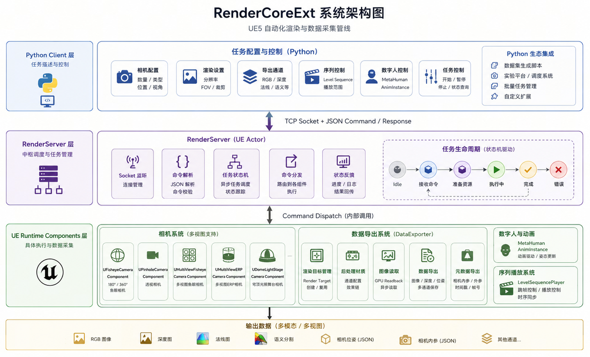
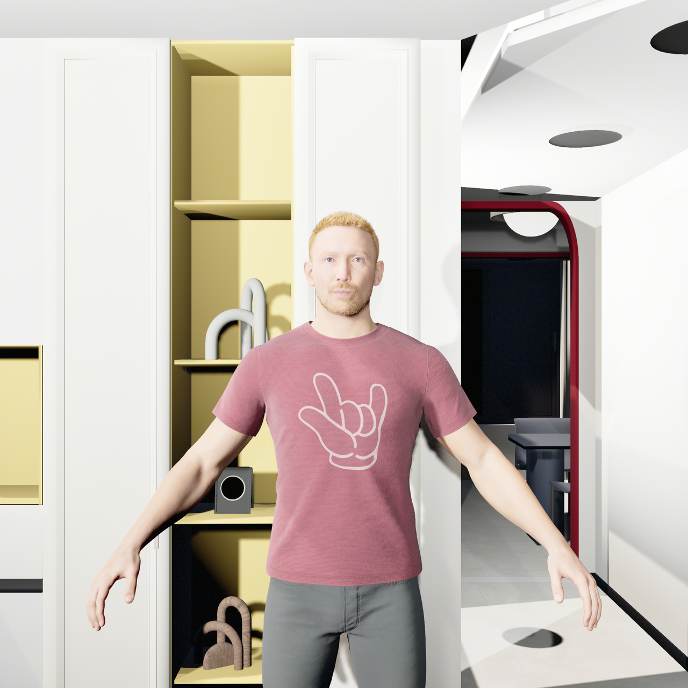
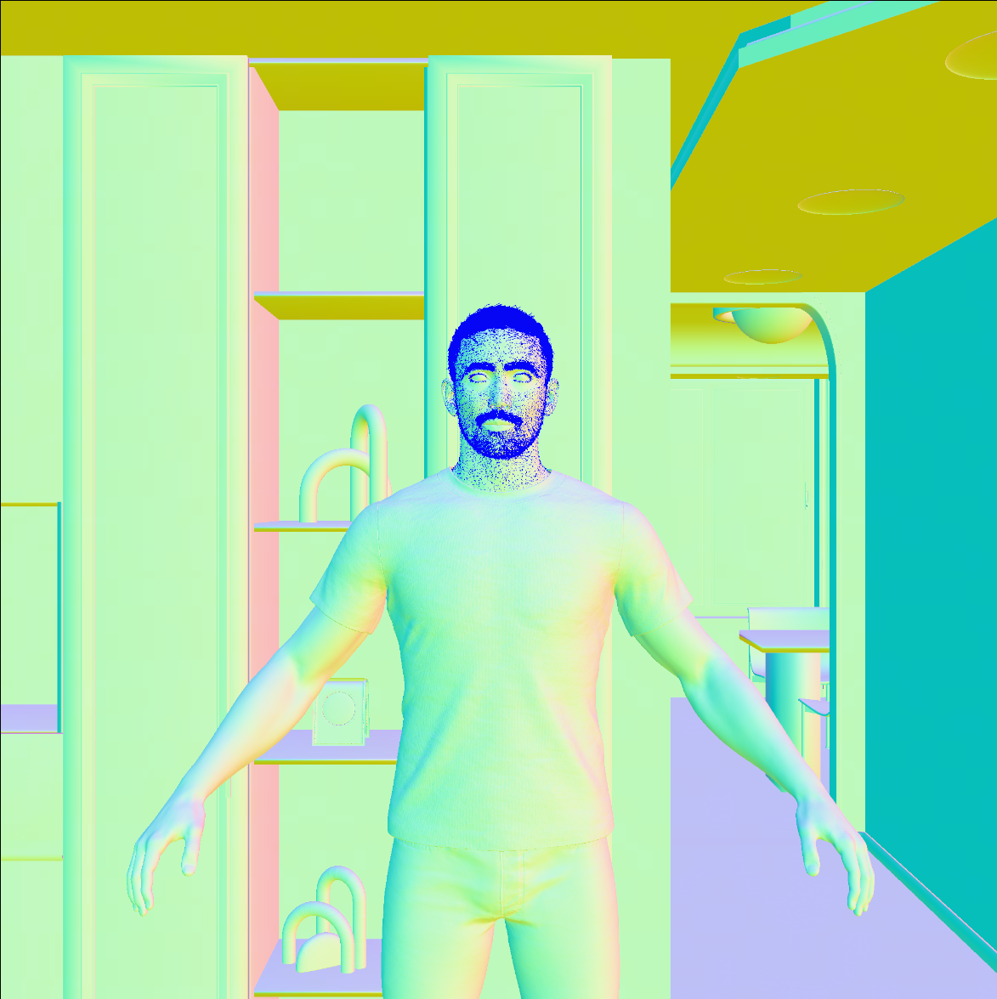
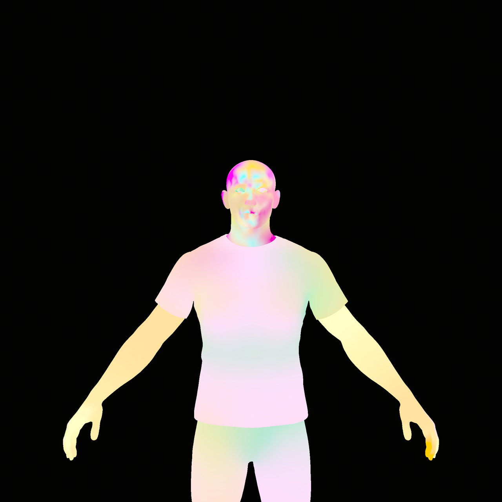
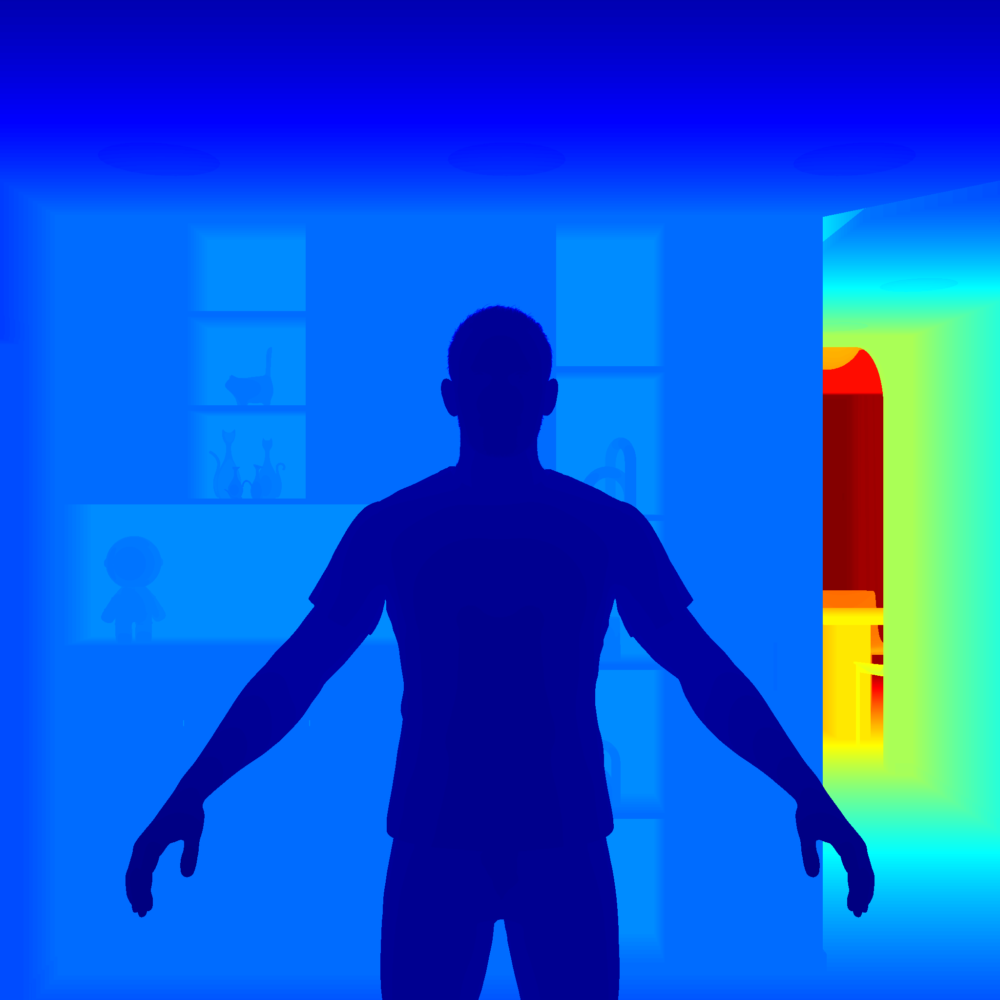
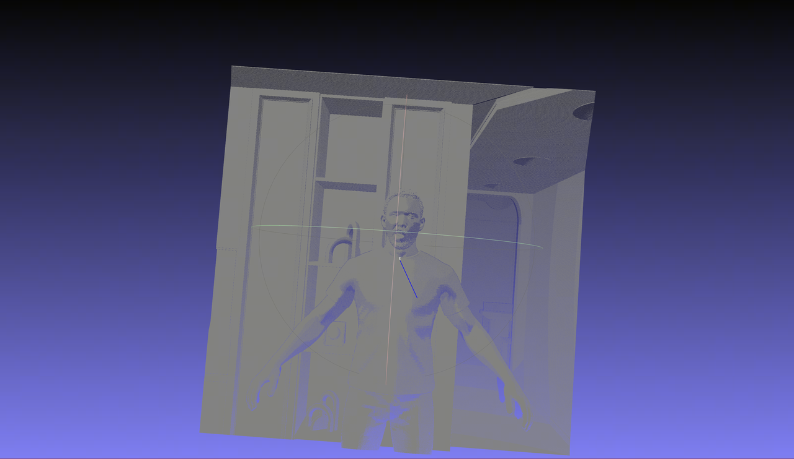
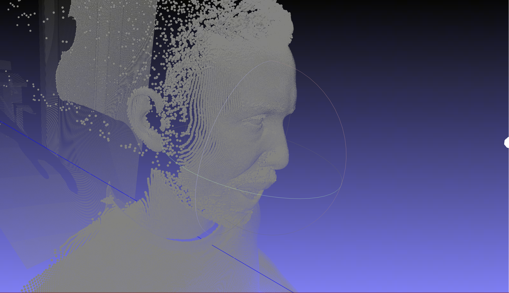
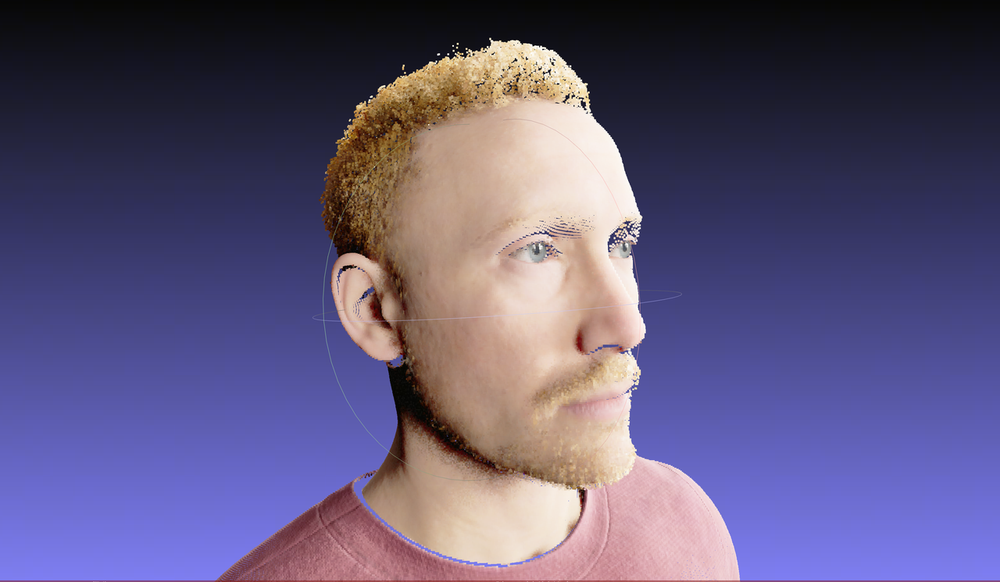
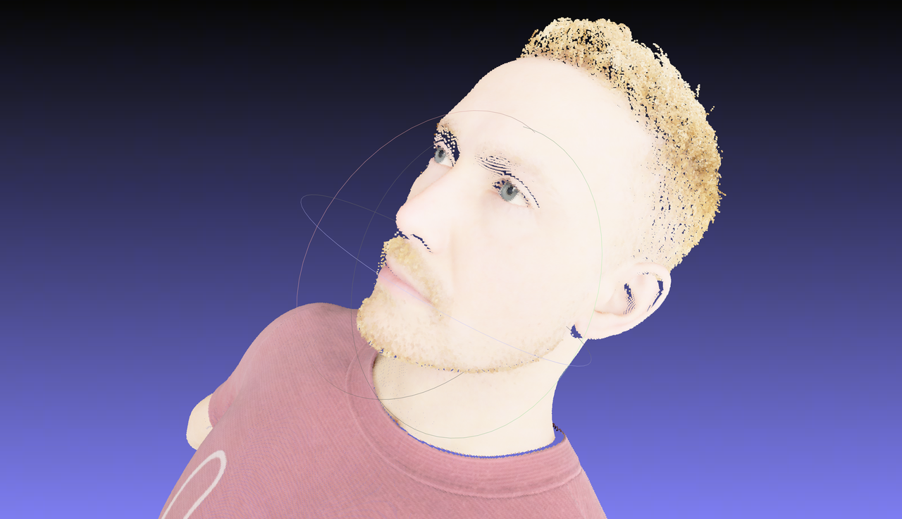

# OmniCaptureUE

OmniCaptureUE is an Unreal Engine 5.5 data simulation and rendering platform built around the `RenderCoreExt` plugin. It is designed for high-precision multi-view capture from configurable camera arrays and light-stage setups, with Python-driven scene control and sequence capture.

The current project supports both static and dynamic scenes. It can render synchronized multi-camera RGB images, depth maps, normal maps, world-position maps, semantic maps, camera intrinsics, camera-array extrinsics, and moving rig pose metadata. The included dome camera rig has been validated on MetaHuman subjects for multi-view, multi-attribute ground-truth generation.



## Highlights

- UE 5.5 runtime plugin for synthetic data capture.
- TCP command server for Python control.
- Configurable camera models: pinhole, fisheye, multi-view fisheye, ERP, and dome light-stage camera arrays.
- Configurable dome camera layouts: manual, ring-based, and Fibonacci sphere.
- Configurable light arrays through JSON.
- Multi-pass output: RGB, depth, normal, world position, and semantic segmentation.
- Level Sequence capture for animated MetaHuman assets.
- Optional ARKit blendshape JSON import for frame-by-frame facial animation override.
- Exported per-frame metadata, including intrinsics, extrinsics, world transforms, and rig pose information.

## Repository Layout

```text
OmniCaptureUE/
  Config/                         Unreal project configuration
  Content/                        Demo maps, MetaHuman content, and scene assets
  Plugins/
    RenderCoreExt/                UE runtime plugin
      Content/Materials/          Capture and AOV post-process materials
      Source/RenderCoreExt/       C++ render server, cameras, data exporter, light manager
      shaders/                    HLSL shaders for fisheye and depth processing
      docs/                       Development and validation notes
    RenderCoreTools/              Python clients, light configs, examples, visual assets
      imgs/                       README images and validation videos
      output/                     Example rendered frame with metadata
  Source/                         UE project module
  dev_uedemo.uproject             UE 5.5 project file
```

## RenderCoreExt Plugin

`RenderCoreExt` provides the rendering and control backend:

- `ARenderServer`: starts a TCP server, listens on port `9998` by default, receives JSON commands from Python clients, and dispatches camera, light, pose, and sequence operations.
- `UFisheyeCameraComponent`: base capture component with RGB, depth, pose, fisheye, cubemap, and export utilities.
- `UMultiViewFisheyeCameraComponent` and `UMultiViewERPCameraComponent`: multi-view and panoramic capture components.
- `UDomeLightStageCameraComponent`: dome camera array component for light-stage style multi-view capture.
- `FLightManager`: creates or updates area, point, and spot lights from JSON.
- `FDataExporter`: handles render-target readback and export.

## Rendered Examples

The following examples use MetaHuman ID4 and show multiple ground-truth attributes rendered by the platform.

| RGB | Normal |
| --- | --- |
|  |  |

| Semantic | Depth |
| --- | --- |
|  |  |

Depth and position outputs can be reconstructed into 3D point clouds to verify geometric correctness.

| Depth to point cloud | Depth to point cloud |
| --- | --- |
|  |  |

| Position to point cloud | Position to point cloud |
| --- | --- |
|  |  |

Animated multi-view captures are included as video assets:

- [ID4 RGB multi-view animation](Plugins/RenderCoreTools/imgs/multiview_rendered_animation_ID4/RGB_video.mp4)
- [ID4 Depth multi-view animation](Plugins/RenderCoreTools/imgs/multiview_rendered_animation_ID4/Depth_video.mp4)
- [ID4 Normal multi-view animation](Plugins/RenderCoreTools/imgs/multiview_rendered_animation_ID4/Normal_video.mp4)
- [ID4 Position multi-view animation](Plugins/RenderCoreTools/imgs/multiview_rendered_animation_ID4/Position_video.mp4)
- [ID4 Semantic multi-view animation](Plugins/RenderCoreTools/imgs/multiview_rendered_animation_ID4/Semantic_video.mp4)

The same pipeline can render different MetaHuman identities:

- [MetaHuman ID1](Plugins/RenderCoreTools/imgs/metahuman_ID1.mp4)
- [MetaHuman ID2](Plugins/RenderCoreTools/imgs/metahuman_ID2.mp4)
- [MetaHuman ID3](Plugins/RenderCoreTools/imgs/metahuman_ID3.mp4)
- [ID1 RGB multi-view animation](Plugins/RenderCoreTools/imgs/multiview_rendered_animation_ID1/RGB_video.mp4)
- [ID1 depth point-cloud validation](Plugins/RenderCoreTools/imgs/ID1_depth转换为3D点云可视化.mp4)
- [ID1 position point-cloud validation](Plugins/RenderCoreTools/imgs/ID1_position转换为3D点云可视化.mp4)

## Environment

Recommended development environment:

- Windows 10/11
- Unreal Engine 5.5
- Visual Studio 2022 with C++ game development tools
- Python 3.10 or newer
- Git LFS recommended for large UE assets and media files

Python dependencies are listed in `Plugins/RenderCoreTools/requirements.txt`:

```powershell
cd Plugins/RenderCoreTools
python -m venv .venv
.\.venv\Scripts\Activate.ps1
python -m pip install --upgrade pip
pip install -r requirements.txt
```

For OpenEXR reading in OpenCV-based tools, set:

```powershell
$env:OPENCV_IO_ENABLE_OPENEXR = "1"
```

## Unreal Setup

1. Open `dev_uedemo.uproject` with Unreal Engine 5.5.
2. Let Unreal rebuild project modules when prompted.
3. Enable or verify these project plugins when needed: MetaHuman, LiveLink, AppleARKitFaceSupport, Movie Render Pipeline, and RenderCoreExt.
4. Open the target map or sequence.
5. Add a `RenderServer` actor to the level, or use an existing one.
6. Confirm its `ListenPort` is `9998`.
7. Add or select the capture actor used by the Python client. The default client expects an actor named `MyMetaHuman` and a dome camera component named `DomeCam`.
8. Press Play in Editor or run the packaged project so the TCP server starts.

The UE log should contain a line similar to:

```text
RenderServer listening on port 9998
```

## Python Client Usage

Run Python clients from `Plugins/RenderCoreTools` unless absolute paths are used.

### Create the Light Array

`create_light.py` reads `dome_light.json` and sends a `create_lights` command to UE.

```powershell
cd Plugins/RenderCoreTools
python create_light.py
```

`dome_light.json` stores the dome light-stage layout. Each light entry supports fields such as:

- `name`
- `type`: `AREA`, `POINT`, or `SPOT`
- `enabled`
- `location`
- `rotation_euler`
- `energy`
- `color`
- `use_shadow`
- `area_size` and `area_size_y` for area lights

### Capture a MetaHuman Level Sequence

`driveface_sequence_client.py` is the main sequence-capture client. It can configure the dome camera array, seek a Level Sequence frame-by-frame, optionally apply ARKit facial coefficients, and trigger multi-pass rendering.

Basic capture:

```powershell
cd Plugins/RenderCoreTools
python driveface_sequence_client.py `
  --host 127.0.0.1 `
  --port 9998 `
  --sequence driveface `
  --capture-actor MyMetaHuman `
  --capture-component DomeCam `
  --export-path "D:/sim_result/driveface_demo" `
  --start-frame 0 `
  --end-frame 120 `
  --frame-step 1
```

Capture a single frame:

```powershell
python driveface_sequence_client.py `
  --sequence driveface `
  --single-frame 24 `
  --export-path "D:/sim_result/single_frame"
```

Use ARKit coefficients:

```powershell
python driveface_sequence_client.py `
  --sequence driveface `
  --arkit-json "D:/data/arkit_sequence.json" `
  --export-path "D:/sim_result/arkit_capture"
```

Important options:

| Option | Meaning |
| --- | --- |
| `--host`, `--port` | UE render server address. Default is `127.0.0.1:9998`. |
| `--sequence` | Level Sequence actor name or label. |
| `--metahuman-actor` | MetaHuman actor used for face override. Defaults to the capture actor. |
| `--capture-actor` | Actor that owns the camera component. Default: `MyMetaHuman`. |
| `--capture-component` | Camera component name. Default: `DomeCam`. |
| `--arkit-json` | Optional ARKit coefficient sequence JSON. |
| `--export-path` | Output directory. If omitted, the script writes to its built-in default path. |
| `--start-frame`, `--end-frame` | Sequence frame range. |
| `--frame-count` | Alternative to `--end-frame`; captures a fixed number of frames. |
| `--frame-step` | Frame stride. |
| `--wait-frames` | UE frames to wait after sequence seek before capture. |
| `--single-frame` | Capture only one frame. |
| `--seek-only` | Seek sequence without rendering. |
| `--skip-configure` | Do not reconfigure the camera array. |
| `--keep-cameras` | Keep existing camera components before configuration. |
| `--resolution` | Per-camera square output resolution. Default: `2048`. |
| `--dome-radius` | Dome camera radius in Unreal centimeters. |
| `--dome-batch-size` | Number of cameras rendered per batch. |
| `--dome-enabled-passes` | Bitmask for passes. Default `0x1F` enables all passes. |

Pass bitmask:

```text
RGB      0x01
Depth    0x02
Normal   0x04
Position 0x08
Semantic 0x10
All      0x1F
```

Example: RGB and depth only:

```powershell
python driveface_sequence_client.py --dome-enabled-passes 0x03
```

### Manual Dome Camera Layout

The default client configures a 17-camera upper-hemisphere dome:

- 8 cameras around the lower ring
- 8 cameras around the upper ring
- 1 top camera

The camera list is defined in `build_manual_dome_cameras()` inside `driveface_sequence_client.py`. Each camera has:

```json
{
  "name": "cam_front",
  "pos": [-200, 0, 150],
  "rot": [0, 0, 0],
  "fov": 45
}
```

Positions are relative to the capture actor and use Unreal centimeters. Rotations are `[pitch, yaw, roll]` in degrees.

## Output Format

Dome capture writes one folder per frame:

```text
Frame_0001/
  cam_front_RGB.png
  cam_front_Depth.exr
  cam_front_Normal.exr
  cam_front_Position.exr
  cam_front_Semantic.png
  ...
  dome_cameras_metadata.json
```

An example output frame is available at:

```text
Plugins/RenderCoreTools/output/Frame_0001
```

`dome_cameras_metadata.json` records per-camera calibration and file names, including:

- camera name and index
- image resolution
- FOV and intrinsics
- world-space extrinsics
- RGB/depth/normal/position/semantic output file names

## Build and Packaging

The repository includes Windows batch files with local path examples:

- `build_plugin.bat`: builds the `RenderCoreExt` plugin with Unreal Automation Tool.
- `package_project.bat`: packages the full UE project.

Before using them, edit the UE engine path, project path, plugin path, and output directory for your machine.

Typical UAT plugin build form:

```powershell
RunUAT.bat BuildPlugin `
  -Plugin="D:/path/to/OmniCaptureUE/Plugins/RenderCoreExt/RenderCoreExt.uplugin" `
  -Package="D:/Release/RenderCoreExt_Plugin_v1.0" `
  -Rocket `
  -TargetPlatforms=Win64
```

## Notes

- Keep the UE project running while Python clients send commands.
- Use writable export paths with enough disk space; multi-camera EXR output can become large quickly.
- For high-resolution dome captures, increase `--hold-seconds` if the client connection must remain open longer.
- Depth and position maps are exported as high-precision EXR files and can be reconstructed into 3D point clouds for validation.
- Semantic rendering uses vertex-color or material replacement paths depending on the available MetaHuman mesh and material setup.

